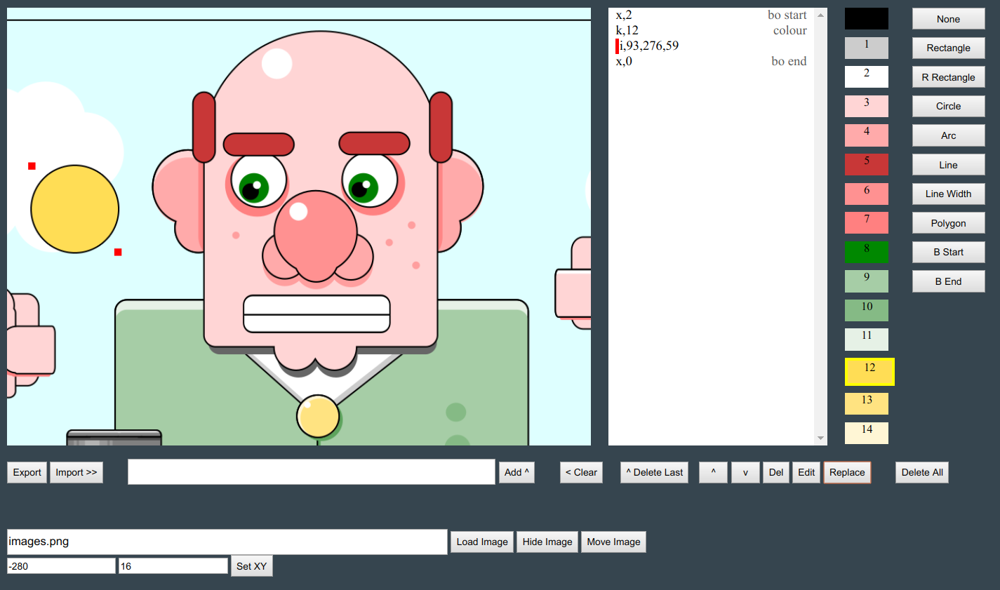

# js13k-mini-svg-editor
Web based editor for creating mini-svg-like graphics for your js13k entry

### Instructions



- Click on one of the buttons on the far right to add the appropriate shape.
- Edit it in the main window by dragging the red nodes, then click 'Add' to store it in the list.
- Click on the palette to add colours.
- The buttons underneath the list allow you to edit, rearrange and replace the commands in the list.
- Click on an item in the command list to select it - you'll see a red marker beside the command.
- Once you're done, hit 'Export', the final data string is dumped in the console.
- To move a loaded reference image, click 'Move Image', then click and drag the image. When you release the mouse button, you'll have to click 'Move Image' again.
- The 'B Start' and 'B end' command allows you to add a nice black outline to a group of shapes. Note: Colours need to be in the group, doesn't work for polygons. In essence it 'pre-draws' the entire group in black, enlarged by x,? pixels, and then draws the group with colours.

### Issues
- Palette is hardcoded.
- It's all a bit slapdash and buggy.
- Polygon editing is a pain. Add a polygon, move the three points around, manually type in some dud points in the entry field, then 'Add' the polygon. Then, select it, click 'Edit', and now you can move the extra points around. Hit 'Replace' to save the polygon in the list.
- When you edit a shape, the old one sticks around and gets in the way until you hit 'Add' or 'Replace'
- I have not tested the 'Import' command. In theory, if you chuck your exported data into the entryfield and click 'Import' it should recreate 'most' of the original commands.
- To load an image as a reference, it needs to be in the /build folder I think
- Sometimes you can't edit a selected shape. The nodes won't move. 'Clear' the entry field, click on one of the shape buttons (rectangle, whatever) and after that you should be able to select and edit the original shape again.

### Usage
Run `npm install`

- `npm start`
  - builds files from `./src/index.js` as an entry point
  - places files into `./build`
  - serves `./build`
  - watches `./src` for specific file types

Editor should be available on http://localhost:8081 after that
(port 8081 so that I can run my js13k entry alongside on port 8080 ;)

### So what's the point of all this?

The idea was to be able to use large, complex, high-res art in js13k entries, but using a markup that is less verbose than SVG or Path2D or CSS.

Secondary goal: The markup has to be human editable.

For a yellow 100x100 rectangle at 100,100 with a black 2px outline, the end result is something like

```
x,2k,12b,100,100,100,100x,0
```

Here's some ugly trees
```
x,2k,5n,217,474,35,89,20k,8f,338,511,132,514,230,327k,10f,308,434,159,435,230,279k,9f,272,342,191,343,228,200x,0x,2k,5b,526,260,34,311k,8i,541,247,106i,602,305,50i,631,257,50i,622,202,50i,588,152,50i,526,117,50i,479,157,50i,456,210,50i,450,275,50i,509,317,50x,0x,2k,7i,522,264,12i,483,184,12i,574,139,12i,620,207,12i,600,313,12x,0
```

### How do I use the data in my game?


### Extensions

The way the pallete is defined, it should be trivial to generate lots of different colour variations of the same sprites. 

It should be pretty straightforward to extend the markup and add new shapes, or for example add a modifier to the shapes so that the sprites have a random element.
e.g.

Generate a rectangle with a random size.
```
x,2k,12b,100,100,r(80,100),r(80,100)x,0
```
Generate a 100 random flowers or trees?


